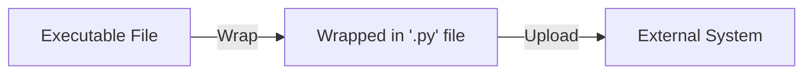
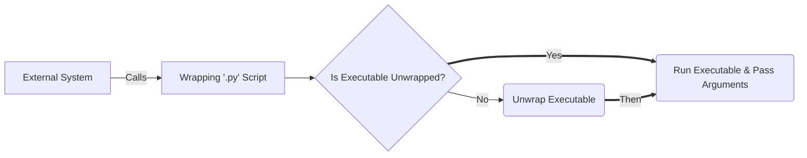

# wrapin-py

Wrap a binary executable file in a Python file and delegate python calls to that binary, enabling the usage of a compiled executable in a sandboxed or jailed execution environment for a script.

## Liability

__*Try at your own risk!*__  
Although this "hack" does not attempt to do anything that requires high-privilege, neither does it use any non-conventional privilege-escalation technics, I cannot guarantee that it will work on your system or that it will not break anything.

## Usage

```bash
python wrapin.py --help
```

<details>
<summary>Output (click to expand)</summary>

```text
usage: wrapin.py [-h] [-o OUTPUT] [-t TARGET] binary_file

Wrap a binary file into a Python file container to be used in 
the context of scripting environments that are some what limited to Python and its core libraries.

positional arguments:
  binary_file           The binary file to be wrapped inside the Python file container.

options:
  -h, --help            show this help message and exit
  -o OUTPUT, --output OUTPUT
                        Specify the output path for the Python container file.
  -t TARGET, --target TARGET
                        Specify the target operating system for the binary file: `Windows`, `Linux` or `Darwin`. By
                        default, the current operating system is selected. Mismatch of configurations with the wrapped
                        file will cause a failure in execution and will exit with an error.
```

</details>  

### Wrap an Executable

```powershell
python wrapin.py hello_world_windows.exe
```

Will produce the next file: `hello_world_windows.exe.wrapped.py`:

📦CURRENT DIRECTORY  
 ┣ 📜hello_world_windows.exe  
 ┣ 📜hello_world_windows.exe.wrapped.py  
 ┗ 📜wrapin.py

### Wrap an Executable for a different Architecture

The next is an example of wrapping a *Linux* binary file while running in a *Windows* environment

```powershell
python wrapin.py hello_world_linux.bin --target=linux
```

## Motivation

This project serves me as a Proof-of-Concept, and hopefully, scripting directly in the Rust programming language, will be a thing of the future for closed systems.

It is most common for interrupted languages to be used as scripting languages within closed source products, running under a very limited sandbox or jailed with mostly being able to only use the base libraries of the language. One such language is one of my favorites: Python.

For most use cases, Python is just powerful and easy enough for about any task and would be just fine.

As I learned and worked with the Rust programming language recently, I realized it has some big advantages that could serve me when my projects (scripts or otherwise) get long and complicated with their logical flows. An advantage well felt when returning to an old Python project (even when it has a good or even a great design). This ultimately lead me to wonder if using Rust, a statically-compiled, strongly-typed, new generation of a low-level language (e.g. C\C++), could serve me for complex script designs, kinda take us back to the days of scripting with the C language when it used to be called "superscripts" only this time, armed with the modern and powerful Rust compiler as a guardian over my code correctness.

## Advantages

1. __*Single file*__, independent of any runtime environment, that can embed third-party libraries in a single file and offer APIs that aren't available on the core base Python API that is provided by the sandbox.  
   - __Caveat:__ as long as your binary does not try to dynamically link with restricted or missing third-parties API from the underlying operating system of the limited sandbox environment (e.g. `cmake` or native `OpenSSL`).

2. Using a strongly typed, statically compiled programming language for complex projects, that is also highly performant.

## Methodology

### Wrap & Upload the Executable



### Auto-Unwrap & Delegate Script Calls



The wrapped file is unwrapped into the running user's home directory under a new directory called `unwrapped`. This is done to make sure that permissions will not pose a problem.

## Tested On

*This list only indicates what has been tested and proven to work so far and does not reflect possible usability for other systems*

- QRadar Community Edition 7.3.3 (`Custom Actions`)
  - Rust binary file, compiled for  `i686-unknown-linux-musl`

## Contribution  

Tried it on a system that is not listed here and it worked?  
Feel free to add that system to the list in a pull request!  
*Just don't forget to mention how you achieved that, preferably in a markdown language that can later be converted into a guide.*

Feel free to contribute in anyway you like:

- Discussions  
- Issues (Report bugs, mistakes, request features, etc.)  
- Pull Requests  
- Blog Posts  
- Guides  
- etc.  

## License

This project and any direct contribution to it are licensed under the MIT license.

Refer the `LICENSE` file in this repository for more details.
